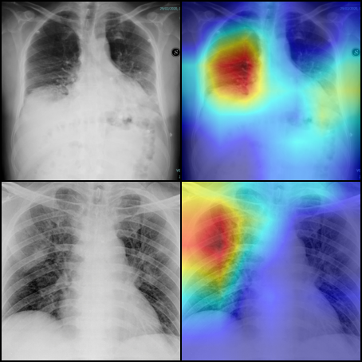

# PyTorch COVID-19 detection

Detect COVID-19 from Chest X-Ray Images.

# Notebook

There are two notebooks in *notebooks* folder. One is for training, another for showing the GradCAM. 

# Dataset
These are the links that I've accumulated the dataset

- [ieee covid dataset](https://github.com/ieee8023/covid-chestxray-dataset)
- [Kaggle Pneumonia Dataset](https://www.kaggle.com/paultimothymooney/chest-xray-pneumonia)
